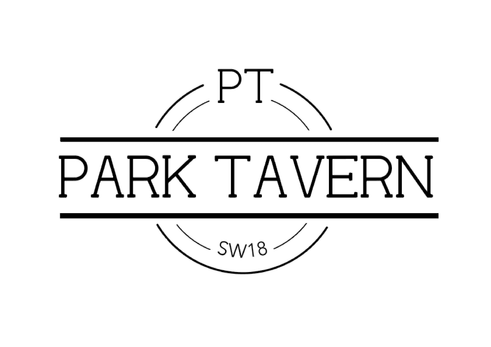

# MileStone Project Three- Park Tavern South African Wine List

A useful data centric website. I am designing a website based on the extensive South African wines the we
offer at the Park Tavern pub in the heart of Southfields. I actually work at the pub and have a great
passion for wine and particularly South African coming from there originaly. I feel this will be a very
useful tool especially over lockdown where we have time to get our guest's to write reviews, especially 
well we are still offering deliveries for wines under current restrictions. As well as a useful time for 
staff members to update their knowledge base and allows them to take time to review the wines. A wise 
person once told me knowledge is power, so I will leave you with that thought well I get on with my website.

 
# Table of Contents

**[UX](#UX)** 
**[Features](#Features)** 
**[Technologies Used](#Technologies-used)** 
**[Testing](#Testing)** 
**[Deployment](#Deployment)** 
**[Credits](#Credits)** 
**[Acknowledgement](#Acknowledgement)** 

## UX
 

### User Stories
--
1. As a guest at Park Tavern i want to be able to identify the selection of South African wines served
2. As a guest of Park Tavern I want to be able to review the wines and keep a record of my favorites and 
see what other humans think of the wines.
3. As someone who loves wines I want to broaden my horizons and learn about new and exciting wines.
4. As a local/regular guest at the Park Tavern I want to see what others think and get the best one out
there, and be recommended yummy wines.
5. As a business owner I want to show off our great variety and quality of wines in a professional and 
informative way.
6. As a business owner I want the site to be appealing and on brand to my business.
7. As a staff member I want to be able to read up and get lots of information to help me be more knowledgable
and able to reccomend to our awesome guests with ease and confidence. 
8. As a staff member I want to be able to add my own review/tasting notes to keep a record when tasting the
wines. A guest always values a staff members thoughts!!

### Wireframes
Below I have 2 different Wireframes in order to ensure the design of my project works responsively. 
These were of course the initial design and a few parts have changed due to practicality and more realistic
when visualy looking at the end product.The medium and desktop are the same as it was only smaller 
devices where it had to be changed. Both are in the same folder. 

#### DESKTOP
[Desktop WireFrames](MS3 Wireframes.bmpr)

#### MOBILE 
[Mobile WireFrames]()

### Color scheme
I have chosen the color scheme that fits with the current website design of Park Tavern SW18 to allow 
fluidity of the site. The colors are neutral and easy on the eye. See the image below for the colors 
used throughout my site. 

### Typogrophy
When looking at the typrogrophy of the website I would have liked to explore a few different options but
decided to keep the "Sans-serif" font from google fonts as this is used on the main Park Tavern website 
as when my feature is added I wanted it to keep fluidity and ensure it works professionaly.

## Features

### Search Wines By color
We have an extensive amount of wines so to categorize and allow our user to search by color 
means it makes it easier to navigate around the page. Then to click on each individual wine to 
get more information and a picture of it too.

### More information
A page dedicated to each wine showing their description, price range, region they are from.
Basically allowing our customers to learn more about the wine that they may want to drink.

### Log In
To allow our user to log in and review wines and build themsleves a little review page.

### Register
To get your own account. 

## Features Left to Implement
I have a few features left to implement and these are as follows.
### 
I would like to add a few more features such as get all reviews to show under each wine.
### 
Get a star rating for each wine and see which ones are our users favorites. 

## Technologies Used
Below is a list of all technologies used in order to achieve the end goal.

#### Languages
* HTML -A standard markup language used for the content of my webpage
* CSS - A style sheet language used for the design of the web page
* JavaScript - A text based programming language used to make a web page
interactive, in conjunction with HTML and CSS as a base for formatting.
* Python- for functionality of my site

#### Frameworks
* Bootstrap- Used to format and style my site.
* Flask- Micro framework for python
* MongoDB- to store my database
* Cloudinary- to store my photos and get a url for each of them to link to database

#### Libraries
* Google Fonts [https://fonts.google.com/]
* Font Awesome(Bootstrap Library) [https://www.bootstrapcdn.com/fontawesome/]
* Bootstrap Jquery [https://getbootstrap.com/docs/3.3/javascript/]
* W3 Schools [https://www.w3schools.com/] a great base to get refresher materialswhen help was needed.
* Youtube [https://www.youtube.com/] for some tutorials when things where tough

##### GitPod/GitHub
* GitPod was the IDE I used for my project

##### Heroku
* Heroku was used to deploy my project

## Testing 

* W3C HTML Validator[https://validator.w3.org/]
* W3C CSS Validator[https://jigsaw.w3.org/css-validator/]
* Autoprefixer CSS[https://autoprefixer.github.io/]
* Am I responsive [http://ami.responsivedesign.is/] used to check compatibility with a numerous amount of devices,
see picture below.

* I consistantly was using chrome web developer tools, however when push to my mobile found these to not be the most
accurate. The design was though out to ensure smaller screens were not squished and legible throughout. The layout 
of the other pages are slightly different throughout each breakpoint.

* Tested each page manually to ensure effects worked throughout and responded accordingly.
* Tested manually on teh following devices
    - Iphone 7
    - Ipad 
    - Ipad Pro
    - HP Windows Laptop
    - Mac Book Pro
* Browser Capability- I have tested on the following browsers.
    - Mozilla
    - Microsoft Edge
    - Safari
    - Google Chrome
    - Internet Explorer

## Testing User Stories
1. 
 
## Issues while Testing
*  Only issues that came back from HTML and CSS was that I had forgotten alt attributes for 
my images, now sorted.
* 

## Deployment
For my website I used Heroku to deploy my site, See below steps followed to deploy.

1. Create Name for App
2. Link the app to the GitHub repository by going to the "Deploy" tab in the main app menu.
3. Select a branch to deploy automatically
4. Pipenv to deal with my virtual enviroment and requirements.txt for dependancies
5. Create  "Procfile", needed by Heroku in order to know how to run the app
6. Connected to github with config values stored
7. All connected and up and running on Heroku's servers. 

## Credits

### Content
* Taken from Park Tavern SW18 wine list.
* All written by myself(Meghan Jane Spence)

### Media
* Park Tavern- I used all images from Park Tavern as it is where I work and got permission from 
the owner of the business before using any media. 

## Acknowledgements
* First and foremost my little sister(best friend) for helping with the logo.
* My mentor Maranatha- Generally just giving me the go to attidude I need.
* My amazing man in my life, pushing me through to the last minute to get this done. Thanks Jak! x